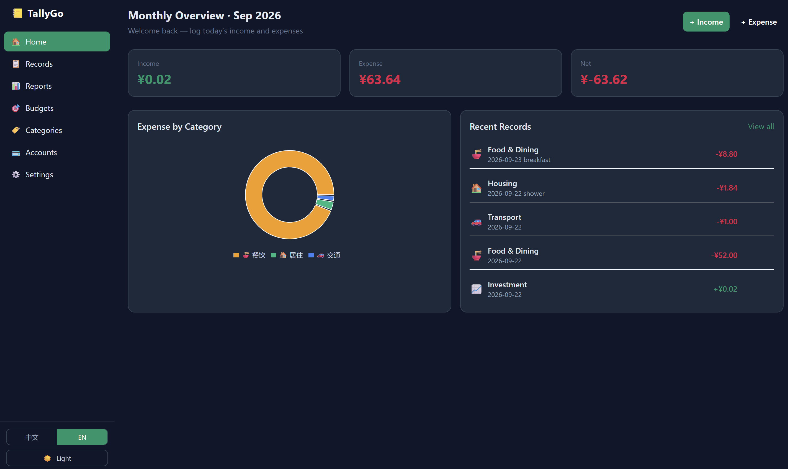

# TallyGo 📒

**轻量化 · 本地优先** 的桌面记账软件 / **Lightweight, local-first bookkeeping app**.

基于 Tauri + React + SQLite：体积小、启动快、数据只存在你的电脑上。
Built with Tauri + React + SQLite — small footprint, fast startup, and your data never leaves your machine.



---

## ⬇️ 下载安装 / Download

前往 **[Releases](../../releases)** 页面下载对应安装包：Apple Silicon Mac 下载 `.dmg`，Windows 下载 `.msi` 或 `.exe`。

Go to the **[Releases](../../releases)** page and download the matching package: `.dmg` for Apple Silicon Macs, or `.msi` / `.exe` for Windows.

Mac：打开 `.dmg`，将 TallyGo 拖入“应用程序”。此版本仅支持 Apple Silicon（M 系列芯片），最低 macOS 11。当前 DMG 使用 ad-hoc 签名，首次打开时 macOS 可能要求在“系统设置 → 隐私与安全性”中允许打开。Windows：打开安装包并按提示安装。用户无需安装 Node.js、Rust 或其他运行库。

Mac: Open the `.dmg` and drag TallyGo to Applications. This build supports Apple Silicon (M-series chips) only and requires macOS 11 or later. The current DMG is ad-hoc signed; macOS may ask you to allow the app under System Settings → Privacy & Security on first launch. Windows: open the installer and follow the prompts. Users do not need Node.js, Rust, or other runtimes.

---

## 🚀 快速上手 / Quick Start

### 1. 记一笔 / Log a record

点击右上角 **+ Income / + Expense**（或「账单」页的 **+ 记一笔**）：

Click **+ Income / + Expense** at the top right (or **+ Add record** on the Records page):

1. 选类型：支出 / 收入 / 转账 → Pick a type: Expense / Income / Transfer
2. 选分类、账户 → Choose category and account
3. 填金额、日期 → Enter amount and date
4. 保存 → Save

### 2. 看报表 / View reports

**报表 / Reports** 页自动生成当月收支汇总、分类饼图、排行和近 12 个月趋势。
The **Reports** page auto-generates monthly totals, a category pie chart, rankings, and a 12-month trend.

### 3. 设预算 / Set budgets

**预算 / Budgets** 页可设置月度总预算或分类预算，超支会提醒。
Set a monthly total or per-category budget on the **Budgets** page — you'll be alerted when overspending.

### 4. 备份数据 / Back up your data

- **设置 → 数据导出**：一键导出 JSON / CSV → **Settings → Export data**: one-click JSON / CSV export
- 或直接复制 `tallygo.db` 文件（位置见下方「数据与隐私」）→ Or copy the `tallygo.db` file (see Data & Privacy below)

---

## 📦 功能一览 / Features

| 功能 Feature | 说明 Description |
|--------------|------------------|
| 收支记账 Income/expense | 支出 / 收入 / 转账，账户余额自动联动 · Expense, income, transfers with auto account balances |
| 分类管理 Categories | 预置常用分类，支持自定义图标与颜色 · Presets + custom icons & colors |
| 多账户 Accounts | 现金、银行卡、支付宝、微信等，总资产一目了然 · Cash, bank, Alipay, WeChat, … with total assets view |
| 月度报表 Reports | 收支汇总、分类饼图、排行、12 个月趋势 · Totals, pie chart, ranking, 12-month trend |
| 预算管理 Budgets | 月度总预算 + 分类预算，进度条与超支提醒 · Monthly total + per-category budgets with alerts |
| 搜索筛选 Filters | 按日期、类型、分类、账户、金额、关键字组合查询 · Date, type, category, account, amount, keyword |
| 导入导出 Import/export | JSON / CSV 本地备份与恢复 · JSON / CSV backup and restore |
| 多语言 i18n | 中文 / English 界面切换 · 中文 / English UI switch |
| 深色模式 Dark mode | 侧边栏一键切换，偏好保存在本机 · One-click toggle in the sidebar, saved locally |

---

## 🔐 数据与隐私 / Data & Privacy

- **全部数据存储在本机 SQLite 单文件**（`tallygo.db`），不上传云端、不联网、无账号、无遥测
- All data lives in a **single local SQLite file** (`tallygo.db`). Zero cloud, no accounts, no network calls, no telemetry.
- 备份 = 复制这一个文件，或在 **设置** 中导出 JSON / CSV
- Backup = copy one file, or export JSON / CSV from **Settings**.

**数据库位置 / DB location:** Windows `%APPDATA%\com.tallygo.desktop\tallygo.db`；macOS `~/Library/Application Support/com.tallygo.desktop/tallygo.db`

---

## 🌐 语言与外观 / Language & Theme

- 侧边栏底部：**中文 | EN**，以及 🌙/☀️ 深浅色切换
- 或进入 **设置 / Settings** 调整
- Sidebar footer: **中文 | EN** and 🌙/☀️ theme toggle, or adjust in **Settings**
- 偏好保存在本机，下次启动自动恢复 / Preferences persist locally across restarts

---

## 🛠️ 从源码构建 / Build from Source

> 仅开发者需要 / For developers only

### 环境要求 Requirements

- Node.js 18+
- Rust（`rustup`）+ Windows Visual Studio Build Tools（含 C++ 桌面开发）
- macOS Apple Silicon：Xcode Command Line Tools + Rust（`rustup`）

### 安装与运行 Install & Run

```bash
npm install

npm run tauri dev      # 开发模式 Development
npm run tauri build    # 打包 Installers → src-tauri/target/release/bundle/
npm run build:mac:arm64 # Apple Silicon DMG → src-tauri/target/aarch64-apple-darwin/release/bundle/dmg/
```

推送 `v*` 格式的 Git 标签（例如 `v0.2.0`）会触发 GitHub Actions，在 Apple Silicon macOS runner 上构建 ARM64 DMG 并附加到 GitHub Release。

Pushing a Git tag matching `v*` (for example, `v0.2.0`) triggers GitHub Actions to build an ARM64 DMG on an Apple Silicon macOS runner and attach it to a GitHub Release.

### 常用命令 Commands

```bash
npm run dev        # 仅前端，浏览器调试 Frontend only (browser, no native APIs)
npm run typecheck  # TypeScript 类型检查 Type check
npm run build      # 构建前端 Build frontend
npm run tauri dev  # 桌面应用开发 Desktop dev mode
npm run tauri build # 打包安装程序 Package installers
```

---

## 📁 项目结构 / Project Structure

```
TallyGo/
├── src/                 # React 前端 Frontend
│   ├── pages/           # 页面 Pages
│   ├── services/        # 数据访问层 Data access (SQLite)
│   ├── components/      # UI 与图表 Components & charts
│   ├── i18n/            # 中英文案 i18n dictionaries
│   ├── store/           # 状态管理 State (theme, etc.)
│   └── types/           # 类型定义 Types
└── src-tauri/           # Rust 后端 Backend
    ├── src/             # 应用入口与插件 App entry & plugins
    └── migrations/      # 数据库迁移 DB migrations
```

---

## 🛠️ 技术栈 / Tech Stack

| 层级 Layer | 技术 Tech |
|------------|-----------|
| 桌面框架 Desktop shell | Tauri 2 (Rust) |
| 前端 Frontend | React 18 + TypeScript + Vite |
| 样式 Styling | Tailwind CSS |
| 图表 Charts | Recharts |
| 数据库 Database | SQLite (`tauri-plugin-sql`) |
| 国际化 i18n | 轻量自研 Lightweight custom (Zustand + dictionary) |

---

## ✨ 核心特点 / Highlights

- **🪶 轻量化 Lightweight** — Tauri 2（系统 WebView + Rust）而非 Electron：安装包小、内存低、冷启动快、无后台常驻
- **🚀 易部署 Easy to deploy** — 一条命令开发 `npm run tauri dev`，一条命令打包 `npm run tauri build`
- **🖱️ 便操作 Easy to use** — 侧边栏导航；三步记账（类型 → 分类 → 金额）；图标点选；月份一键跳转；多条件筛选；自动月度报表
- **🔒 数据安全 Local only** — 全部数据在本机单个 SQLite 文件，零云端依赖，备份 = 复制一个文件

---

## 📄 License

MIT
